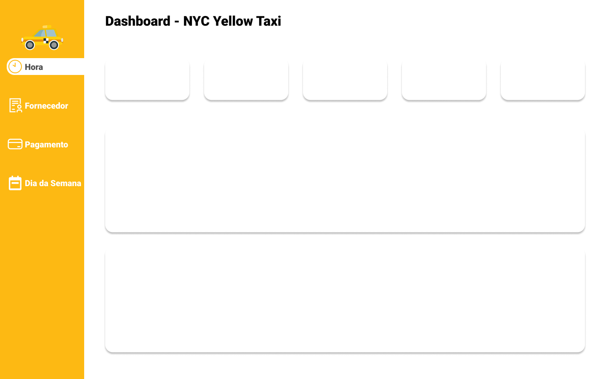
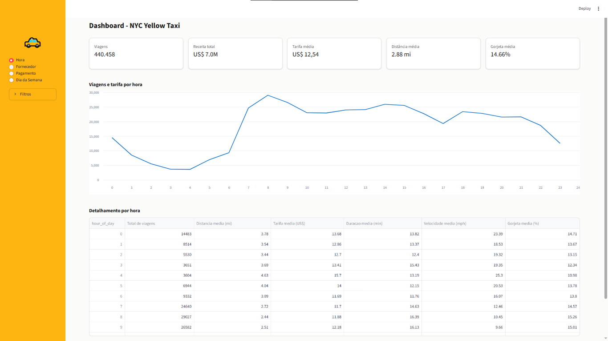
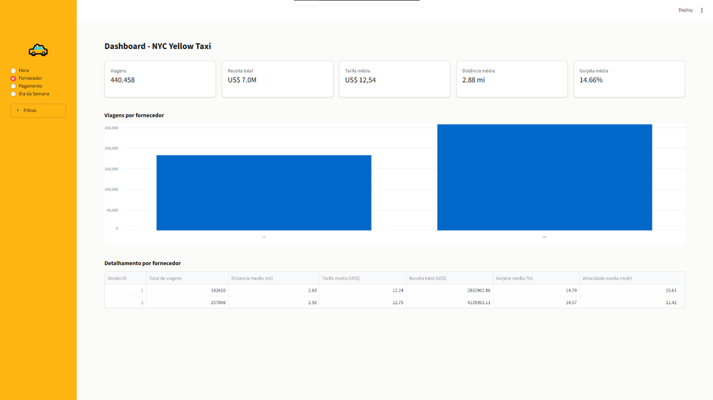
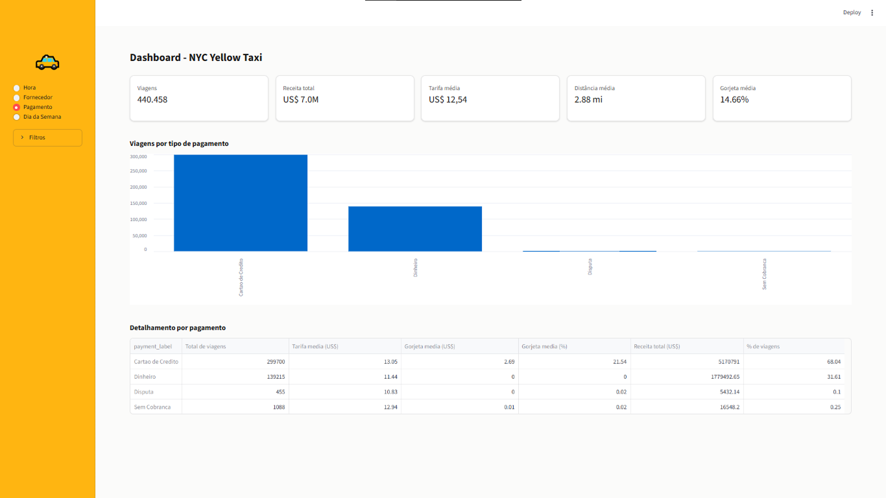

# Projeto de Engenharia de Dados: ETL Simples com Dados de Táxi de Nova York 🚕

## 1. Resumo do Projeto

- **Objetivo:** Este projeto teve como objetivo construir um pipeline ELT simples utilizando dados de viagens de táxi em Nova York. O foco foi entender o fluxo completo de ELT na prática, desde a extração de dados brutos até a análise de Business Intelligence (BI) com visualizações interativas.

- **Problema Resolvido:** O dataset bruto continha volumes inviáveis para processamento leve em máquina local, além de apresentar diversas inconsistências e anomalias nos dados (distâncias zeradas com cobrança, tarifas negativas e registros fora do escopo temporal), foi criada uma rotina de limpeza e tratamento do dado, validação rigorosa de regras de negócio.

- **Tecnologias Utilizadas:** O dataset disponibilizado no Kaggle, Python, Pandas, Streamlit, Quadro, Figma e Git/GitHub.

- **Resultados Principais:**

  - Ingestão controlada de uma amostra de 500.000 registros do NYC Yellow Taxi Trip Data.
  - Redução de 11,91% da base resultando em uma camada analítica limpa de 440.450 linhas.
  - Dashboard interativo com métricas de tempo médio de corrida, distribuição de receita por zona e impacto das gorjetas.

## 2. Estrutura e Links

{fig-align="center" width="100%"}

**Dataset:** NYC Yellow Taxi

**Kaggle:** [Link](https://www.kaggle.com/datasets/elemento/nyc-yellow-taxi-trip-data?select=yellow_tripdata_2016-03.csv)

**GitHub:** [Lucas-Lellis-NYC-Yellow-Taxi-Trip-Data](https://github.com/Lucas-Lellis/NYC_Yellow_Taxi_Trip_Data)

A seguir, estão visualizações reais do arquivo parquet produzido no processo de ETL.

---
```{python}
#| label: tbl-summary
#| tbl-cap: "Métricas principais do dataset limpo"
#| echo: false
#| warning: false

import pandas as pd

df = pd.read_parquet("../data/output/yellow_tripdata_2016-03_cleaned.parquet")
summary = pd.DataFrame({
    "Métrica": [
        "Total de viagens",
        "Distância média (milhas)",
        "Tarifa média",
        "Duração média (min)",
        "Gorjeta média",
        "Receita total"
    ],
    "Valor": [
        f"{len(df):,}",
        f"{df['trip_distance'].mean():.2f}",
        f"${df['fare_amount'].mean():.2f}",
        f"{df['trip_duration_min'].mean():.2f}",
        f"${df['tip_amount'].mean():.2f}",
        f"${df['total_amount'].sum():,.2f}"
    ]
})
summary
```

```{python}
#| label: fig-hourly-trips
#| fig-cap: "Volume de viagens por hora do dia"
#| echo: false
#| warning: false

import pandas as pd
import matplotlib.pyplot as plt


df = pd.read_parquet("../data/output/yellow_tripdata_2016-03_cleaned.parquet")
hourly = df.groupby("hour_of_day").size().reset_index(name="total_trips")

fig, ax = plt.subplots(figsize=(8, 4))
ax.plot(hourly["hour_of_day"], hourly["total_trips"], color="royalblue", marker="o")
ax.set_title("Volume de viagens por hora do dia")
ax.set_xlabel("Hora do dia")
ax.set_ylabel("Quantidade de viagens")
ax.grid(True, linestyle="--", alpha=0.4)
plt.tight_layout()
plt.show()
```

```{python}
#| label: fig-weekday-trips
#| fig-cap: "Média da tarifa por dia da semana"
#| echo: false
#| warning: false

import pandas as pd
import matplotlib.pyplot as plt


df = pd.read_parquet("../data/output/yellow_tripdata_2016-03_cleaned.parquet")
weekday_order = ["Monday", "Tuesday", "Wednesday", "Thursday", "Friday", "Saturday", "Sunday"]
weekday = df.groupby("day_of_week").agg(avg_fare=("fare_amount", "mean")).reindex(weekday_order).reset_index()
weekday.columns = ["day_of_week", "avg_fare"]

fig, ax = plt.subplots(figsize=(8, 4))
ax.bar(weekday["day_of_week"], weekday["avg_fare"], color="forestgreen")
ax.set_title("Média da tarifa por dia da semana")
ax.set_xlabel("Dia da semana")
ax.set_ylabel("Valor médio da corrida")
ax.grid(axis="y", linestyle="--", alpha=0.4)
plt.xticks(rotation=25)
plt.tight_layout()
plt.show()
```

```{python}
#| label: fig-payment-method
#| fig-cap: "Distribuição do tipo de pagamento"
#| echo: false
#| warning: false

import pandas as pd
import matplotlib.pyplot as plt


df = pd.read_parquet("../data/output/yellow_tripdata_2016-03_cleaned.parquet")
payment = df["payment_type"].value_counts().reset_index()
payment.columns = ["payment_type", "total_trips"]

fig, ax = plt.subplots(figsize=(7, 4))
ax.pie(payment["total_trips"], labels=payment["payment_type"], autopct="%1.1f%%", startangle=90)
ax.set_title("Distribuição do tipo de pagamento")
plt.tight_layout()
plt.show()
```
---

## 2. Fluxo do Pipeline (Step by Step):

### 2.1 Extração dos dados

- O processo começou com a leitura do arquivo CSV `yellow_tripdata_2016-03.csv` utilizando a biblioteca Pandas.
- Foi carregada uma amostra de 500 mil registros para facilitar a análise local e reduzir o custo computacional.
- A etapa inicial também incluiu validação básica da estrutura do dataset, como quantidade de linhas, colunas e visualização dos primeiros registros.
- Com isso, foi possível confirmar que a base estava em um formato adequado para o início do pipeline.

### 2.2 Verificação de qualidade e detecção de anomalias

- As colunas de data foram convertidas para o tipo datetime para permitir cálculos de tempo e filtros mais robustos.
- Foi feita a checagem de valores nulos para identificar problemas de integridade dos dados.
- Em seguida, regras de negócio foram aplicadas para detectar registros inválidos, como:
  - passageiros fora do intervalo aceitável;
  - distância de viagem zerada ou muito alta;
  - `RatecodeID` fora do padrão;
  - gorjetas negativas;
  - duração de viagem inconsistente;
  - coordenadas fora da região de Nova York.
- Todos esses registros foram marcados em uma máscara e removidos da base para evitar distorções na análise.

### 2.3 Transformação e criação de colunas analíticas

- A base foi tratada para gerar novas variáveis que ampliam o valor analítico do conjunto:
  - `trip_duration_min`: duração total da viagem em minutos;
  - `hour_of_day`: hora da coleta da viagem;
  - `date`: data da corrida;
  - `day_of_week`: dia da semana;
  - `trip_speed_mph`: velocidade média da viagem;
  - `tip_pct`: percentual de gorjeta;
  - `revenue_per_mile`: receita por milha.
- Essas variáveis permitem responder perguntas mais relevantes de negócio, como horários de pico, desempenho por dia e padrão de cobrança.

### 2.4 Agregações e métricas de negócio

- A base tratada foi agregada por diferentes dimensões para gerar indicadores de negócio:
  - por hora do dia;
  - por dia da semana;
  - por tipo de pagamento;
  - por fornecedor (`VendorID`).
- Os resultados foram organizados em tabelas que resumem métricas como:
  - total de viagens;
  - distância média;
  - tarifa média;
  - duração média;
  - gorjeta média;
  - receita total.
- Essas agregações servem como base para a análise exploratória e para a construção dos gráficos do dashboard.

### 2.5 Carregamento da camada limpa

- A base final já tratada foi salva em formato Parquet no diretório de saída:
  - `../data/output/yellow_tripdata_2016-03_cleaned.parquet`
- O parquet foi escolhido por ser um formato mais eficiente para armazenar dados tabulares em pipelines de análise.
- A etapa final garante que a camada limpa fique disponível para reutilização em relatórios, dashboards e novas análises futuras.

### 2.6 Visualização e interpretação dos resultados

- Os dados limpos foram utilizados para criar visualizações de:
  - volume de viagens por hora;
  - tarifa média por dia da semana;
  - distribuição de formas de pagamento;
  - métricas principais do conjunto.
- Essas visualizações transformam o banco em informações estratégicas e ajudam a comunicar os achados de forma clara para o público final.

## 3. Dashboard:

Imagem no Figma



Imagens no Streamlit








## 4. Conclusão

Este projeto foi uma aplicação prática de conceitos fundamentais de engenharia de dados, com foco em ETL, limpeza, organização e análise de um conjunto real de dados. Ao longo do processo, foi possível perceber como a qualidade dos dados impacta diretamente a confiabilidade dos resultados finais e a importância de transformar informações brutas em indicadores úteis para tomada de decisão.

A combinação entre pipeline, análise exploratória e dashboard reforça a proposta do projeto: demonstrar, de maneira simples e didática, como dados de mobilidade urbana podem ser utilizados para gerar insights relevantes. O resultado final mostra que mesmo um fluxo inicial de ETL pode gerar valor analítico significativo quando desenvolvido com organização e atenção à qualidade dos dados.